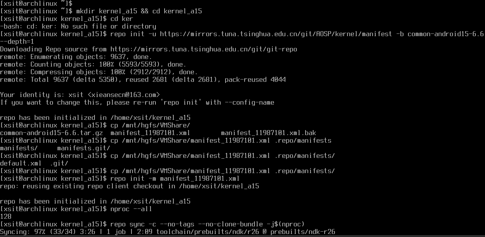
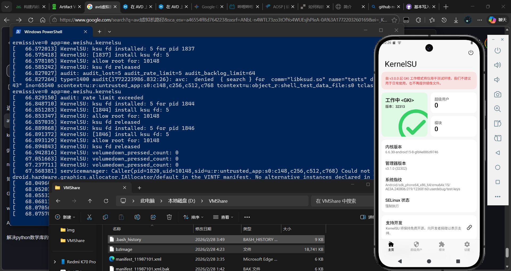

# 记编译 AVD kernel-ranchu 内核的一次过程



## 1.序
### 博览 [AVD_KSU](https://5ec1cff.github.io/my-blog/2024/01/16/avd-ksu/index.html),[AVD_KSU2](https://5ec1cff.github.io/my-blog/2024/01/31/avd-ksu2/index.html)

```bash
cat /proc/version
```
**Linux version 6.6.30-android15-8-gdd9c02ccfe27-ab11987101**: 其中`-ab`后跟的是内核源码树的提交哈希，`-g` 后跟着的是一个 **12 位 16 进制数**，在[BUILD_INFO](https://ci.android.com/builds/submitted/11987101/kernel_virt_x86_64/latest/view/BUILD_INFO)对应

```bash
mkdir kernel_a15 && cd kernel_a15
repo init -u https://mirrors.tuna.tsinghua.edu.cn/git/AOSP/kernel/manifest -b common-android15-6.6 --depth=1
repo init -m manifest_11987101.xml
repo sync -c --no-tags --no-clone-bundle -j$(nproc)
```

## 2.书
### 规训 [KernelSU](https://github.com/tiann/KernelSU.git)

```bash
# 设置全局用户名，邮箱
git config --global user.name "Xieansecn"
git config --global user.email "xieansecn@163.com"
#打上KernelSU
git clone https://github.com/tiann/KernelSU.git
curl -LSs "https://raw.githubusercontent.com/tiann/KernelSU/main/kernel/setup.sh" | bash -s main
git add -A
git commit -m "Add KernelSU"
#设好版本
cd KernelSU
export KSU_VER=$(($(git rev-list --count HEAD) + 10200))
echo $KSU_VER
#编译时设好版本
tools/bazel run --config=fast --config=stamp --lto=none --action_env=KSU_VERSION=$KSU_VER //common-modules/virtual-device:virtual_device_x86_64_dist -- --dist_dir=virt
```

## 终
### Windows
```
.\emulator.exe -avd Pixel_9 -kernel D:\VMShare\bzImage -show-kernel -no-snapshot-load
```
### Linux
```
./emulator -avd Pixel_9 -kernel ~/bzImage -show-kernel -no-snapshot-load
```


