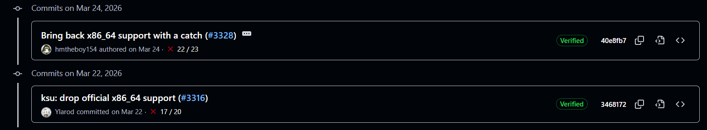

# 优先声明

> [!CAUTION]
>本仓库中标注AI生成的笔记可能并不正确!

如果你不知道什么是KernelSU，请见: [What-is-KernelSU](https://kernelsu.org/guide/what-is-kernelsu.html)

---

## 本仓库说明

- 默认携带KernelSU编译内核，架构：`x86_64`
- 仅在 `x86_64` 架构的AVD虚拟机中测试过！
- 仓库 Releases 未标注 KernelSU 版本！所以本项目仅作为经验分享，推荐您跟随仓库内的文档一步步操作构建您自己的内核。但**从不作为“发行标准”，也不作为“标准发行”。**
- KernelSU 已经放弃内建，转向LKM，本仓库仅提供 *x86_64* 架构的KernelSU内核编译过程经验分享。

---

## AndroidAVD_kernel-ranchu

存我的[ranchu内核和编译教程](Build_一例/Build-Kernel.md)  
一例已不适用于新版，请见: [Support x86_64](https://kernelsu.org/guide/x86_64-support.html)  
二例: [patch-ranchu-experience](patch-ranchu-experience/我自己的经验——AI们总结出的教训.md)

## 从[Releases](https://github.com/Xieansecn/AndroidAVD_kernel-ranchu/releases)选择你需要的内核（已标注版本）

架构：`x86_64`

### 我们还在做的事

> *即使残阳既落，也能温暖最后一片云彩*

附我自己的仓库编译：[KernelSU](https://github.com/Xieansecn/KernelSU)

鸣谢:  

- [hmtheboy154](https://github.com/hmtheboy154)
- [Commit: 40e8fb7](https://github.com/tiann/KernelSU/commit/40e8fb7616bfd875babb45364f5262657538327a)
